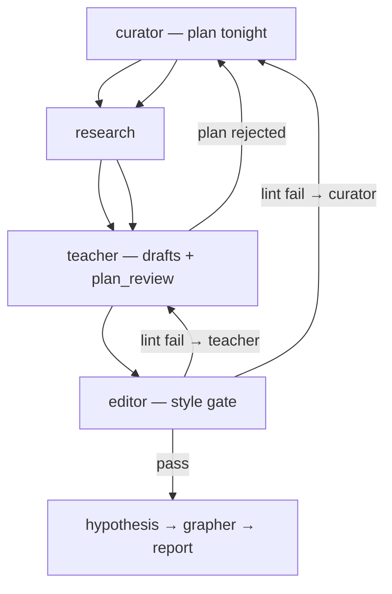

# Nightly Learning

A local multi-agent pipeline that writes **five connected mini-lessons each night** — problem-first, standalone articles aimed at **durable mental models**, not textbook coverage. Output lands in `reports/` and a static site in `site/public/`.

## How the agents work together



**Guaranteed back-edges** (orchestrator-enforced, not optional):

1. **Curator plan lint** — jargon/complexity failures replan curator before editor runs.
2. **Teacher `plan_review`** — teacher can block and send work back to curator.
3. **Editor escalation** — editor lint + `review_summary.escalate_to` sends work to teacher and/or curator.

`--max-refinement-depth` defaults to 2 and cannot be set below 1.

Operator details: [`AGENTS.md`](AGENTS.md).

## Build and run

**One-time setup**

```bash
python3 -m venv .venv
source .venv/bin/activate
pip install -r orchestrator/requirements.txt -r site/requirements.txt
export CURSOR_API_KEY="cursor_..."
```

**Generate tonight's lessons**

```bash
python orchestrator/nightly.py
```

Useful flags: `--dry-run` (offline sample), `--force` (overwrite report and clear stale sidecar files), `--push` (git push after commit).

**Browse the site**

```bash
python site/serve.py
```

Open http://127.0.0.1:8765/

**Optional: schedule nightly at 11pm (macOS)**

```bash
./scripts/install-schedule.sh
```
